# PR Review Comments Handler

## Overview

Process GitHub PR review comments systematically using `gh-pr-threads` CLI tool. Core principle: **check reactions first, classify comment type, use CLI commands (not drafts), never resolve questions**.

## When to Use

- User asks to process/check PR review comments
- Handle CodeRabbit nitpicks or reviewer feedback
- Analyze unresolved threads
- Respond to reviewer questions or suggestions

## Quick Reference

| Task | Command | Notes |
|------|---------|-------|
| Get all threads | `npx gh-pr-threads` | Check reactions |
| Get nitpicks only | `npx gh-pr-threads --only=nitpicks` | Bot suggestions |
| Get thread by ID | `npx gh-pr-threads --thread <id>` | View details |
| Reply (question) | `npx gh-pr-threads reply "text" <id>` | Don't resolve |
| Resolve (fixed) | `npx gh-pr-threads resolve <id> --reply "text"` | Explain what changed |
| Mark nitpicks | `npx gh-pr-threads mark done <id1> <id2> <id3>` | Batch similar items |
| Mark skip | `npx gh-pr-threads mark skip <id>` | Invalid suggestions |

## Decision Flow

```dot
digraph pr_comments {
    "Get threads" [shape=box];
    "Check reactions?" [shape=diamond];
    "Priority threads first" [shape=box];
    "Classify type" [shape=diamond];
    "Nitpick?" [shape=diamond];
    "Question?" [shape=diamond];
    "Options?" [shape=diamond];
    "Mark done (batch)" [shape=box];
    "Reply (don't resolve)" [shape=box];
    "Analyze + recommend" [shape=box];
    "Fix + resolve" [shape=box];

    "Get threads" -> "Check reactions?";
    "Check reactions?" -> "Priority threads first" [label="👀🚀❤️"];
    "Check reactions?" -> "Classify type" [label="no reactions"];
    "Priority threads first" -> "Classify type";
    "Classify type" -> "Nitpick?";
    "Nitpick?" -> "Mark done (batch)" [label="yes"];
    "Nitpick?" -> "Question?" [label="no"];
    "Question?" -> "Reply (don't resolve)" [label="yes"];
    "Question?" -> "Options?" [label="no"];
    "Options?" -> "Analyze + recommend" [label="yes"];
    "Options?" -> "Fix + resolve" [label="no"];
}
```



## Workflow by Type

### 1. Nitpicks (CodeRabbit)
```bash
npx gh-pr-threads --only=nitpicks
# Review validity → Apply fixes → Batch mark
npx gh-pr-threads mark done <id1> <id2> <id3>
```
**No reply/resolve needed** - just mark.

### 2. Questions
**Process:**
1. Read code to understand context
2. Draft technical answer
3. Show user: "I'll reply with: [answer text]"
4. **REQUIRED:** Use CLI command (don't just write text):
```bash
npx gh-pr-threads reply "Your detailed technical explanation here" <id>
```

**CRITICAL RULES:**
- **ALWAYS use the CLI command** (not just draft text)
- **DO NOT RESOLVE** - Let reviewer close after they get answer
- Don't propose code changes in answer to question - just answer the question

### 3. Multiple Options
- Analyze trade-offs (performance, consistency, maintainability)
- Recommend option with WHY (technical reasoning)
- Confirm with user → Apply → Resolve with explanation

### 4. Direct Issues
- Check if already fixed → Apply fix if needed → Resolve with what changed

## Reactions Priority

**Process first:** 👀 (eyes), 🚀 (rocket), ❤️ (heart) = high priority
**Agreement:** 👍 (thumbs up), ✅ (check) = user wants this
**Confusion:** 😕 (confused), ❓ (question) = clarify first
**Done:** 🎉 (party) = verify if already fixed

Always mention reactions: "Thread #42 has 🚀👀 reactions - handling first."

## Key Rules

1. **ALWAYS use CLI commands** - Not text drafts
2. **NEVER resolve questions** - Only reply, let reviewer close
3. **Check reactions first** - Priority indicators
4. **Batch similar items** - Efficiency for nitpicks
5. **Explain WHY** - Technical reasoning for options
6. **Confirm before sending** - Get user approval
7. **Match language** - Reply in reviewer's language
8. **Bot skepticism** - Validate suggestions (check file type, context)

## Common Rationalizations (Don't Do This!)

| Excuse | Reality | Counter |
|--------|---------|---------|
| "I answered, so I'll resolve it" | Questions need reviewer confirmation | NEVER resolve questions - rule #2 |
| "I'll draft a reply for user" | Wast

es time, use CLI directly | Use `npx gh-pr-threads reply` |
| "Bot knows best" | Bots make mistakes | Always validate context |
| "I'll process one by one" | Inefficient for similar items | Use batch commands |
| "Both options are equal" | Codebase has patterns | Analyze for consistency |

## Red Flags - STOP

- Resolving a question thread
- Writing reply text without CLI command
- Processing 5+ similar items individually
- Choosing option without technical justification
- Trusting bot suggestion without validation

**Any of these = Re-read the skill and follow the rules.**

## Requirements

- GitHub CLI (`gh`) authenticated
- Node.js >= 18
- Tool: `npx gh-pr-threads` (installs automatically)
